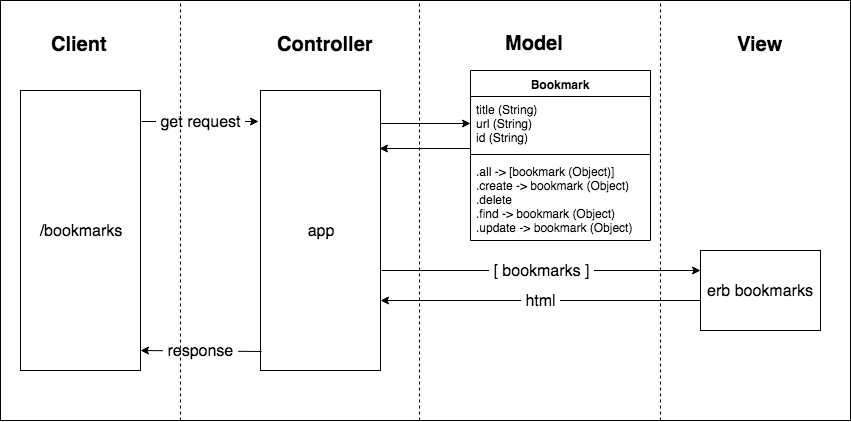
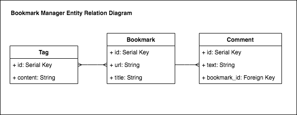

# Bookmark Manager

This code is intended as a supplementary guide for [bookmark manager](https://github.com/makersacademy/course/tree/master/bookmark_manager). The commits on master branch roughly correspond with the walkthroughs provided in the challenge.

## User Stories

```
As a time-pressed user
So that I can quickly go to web sites I regularly visit
I would like to see a list of bookmarks
```

```
As a user
So I can store bookmark data for later retrieval
I want to add a bookmark to Bookmark Manager
```

```
As a user
So that I can keep my bookmarks relevant
I want to delete a bookmark
```

```
As a user
So that I can keep my bookmarks up to date
I want to edit a bookmark
```

```
As a user
So that the bookmarks I save are useful
I want to only save a valid URL
```

```
As a user
So that I can make interesting notes
I want to add a Comment to a Bookmark
```

```
As a user
So that I can categorize my bookmarks
I want to add a Tag to a Bookmark
```

```
As a user
So that I can find relevant bookmarks
I want to filter Bookmarks by a Tag
```

```
As a user
So that I can have a personalised bookmark list
I want to sign up with my email address
```

```
As a user
So that I can keep my account secure
I want to sign in with my email and password
```

```
As a user
So that I can keep my account secure
I want to sign out
```

## Domain Model

Below is a domain model for the bookmarks model.




## Entity Relationship Diagram

The below diagram indicates that:
- A Bookmark *has many* Comments
- A Comment *belongs to* a Bookmark



## How to use

### To set up the project

Clone this repository and then run:

```
bundle
```

### To set up the database

Connect to `psql` and create the `bookmark_manager` and `bookmark_manager_test` databases:

```
CREATE DATABASE bookmark_manager;
CREATE DATABASE bookmark_manager_test;
```

To set up the appropriate tables, connect to each database in `psql` and run the SQL scripts in the `db/migrations` folder in the given order.

### To run the Bookmark Manager app:

```
rackup -p 3000
```

To view bookmarks, navigate to `localhost:3000/bookmarks`.

### To run tests:

```
rspec
```

### To run linting:

```
rubocop
```
